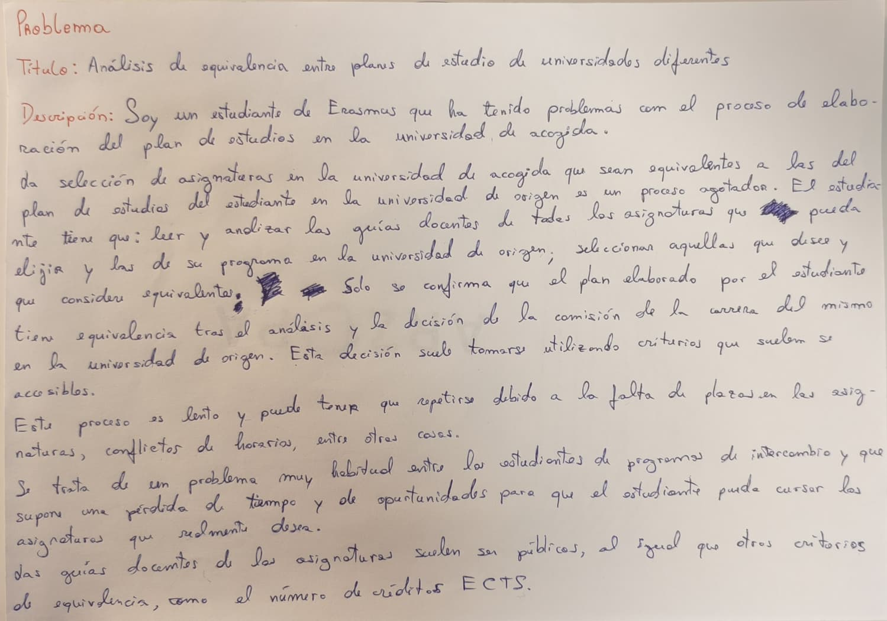

# Análisis de equivalencia entre planes de estudio de Universidades diferentes

## Problema

Soy un estudiante de Erasmus que ha tenido problemas con el proceso de elaboración del plan de estudios en la universidad de acogida.

La selección de asignaturas en la universidad de acogida que sean equivalentes a las del plan de estudios del estudiante en la universidad de origen es un proceso agotador. El estudiante tiene que: leer y analizar las guías docentes de todas las asignaturas que pueda elijir y las de su programa en la universidad de origen; seleccionar aquellas que desee y que considere equivalentes. Solo se confirma que el plan elaborado por el estudiante tiene equivalencia tras el análisis y la decisión de la comisión de la carrera del mismo en la universidad de origen. Esta decisión suele tomarse utilizando criterios que suelen ser accesibles.

Este proceso es lento y puede tener que repetirse debido a la falta de plazas en las asignaturas, conflictos de horarios, entre otras cosas.

Se trata de un problema muy habitual entre los estudiantes de programas de intercambio y que supone una pérdida de tiempo y de oportunidades para que el estudiante pueda cursar las asignaturas que realmente desea.

Las guías docentes de las asignaturas suelen ser públicas, al igual que otros criterios de equivalencia, como el número de créditos ECTS.

## Documentación adicional

- [Configuración de git y GitHub](docs/configuracion.md)