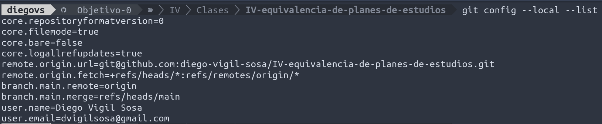

# Configuración del entorno

## Autenticación SSH con GitHub

He generado una clave SSH y he subido la parte pública a GitHub. El comando ssh -T git@github.com confirma que la autenticación funciona con mi cuenta.

## Configuración de nombre y correo en git

He configurado el nombre y el correo electrónico localmente en este repositorio (con git config sin --global).

## Perfil de GitHub con avatar

He sustituido el avatar predeterminado por una foto mía.

